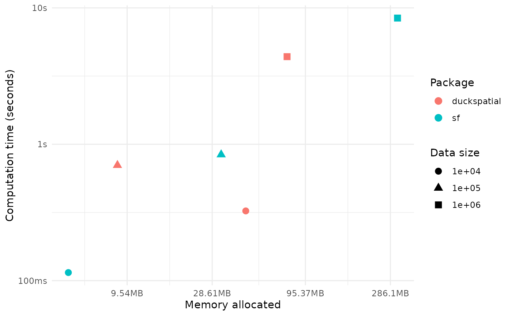

# Benchmark

This vignette shows a few benchmarks comparing **{duckspatial}** vs
**{sf}**. We look at how both packages compare in terms of computation
time and memory use when performing different spatial operations with
increasingly large data sets. We plan to extend this vignette in the
future to benchmark other types of spatial operations.

## Spatial Join

Here we analyze how {duckspatial} and {sf} compare when performing a
spatial join between points and polygons with increasingly large numbers
of points.

### TL;DR

- {sf} is faster for small data sets, when the time and memory
  differences really don’t matter that much. However, for large data
  sets (e.g. above 100K points), {duckspatial} is much faster and uses
  way less memory.

``` r
library(duckspatial)
library(bench)
library(dplyr)
library(ggplot2)

# read polygons data
countries_sf <- sf::st_read(system.file("spatial/countries.geojson", package = "duckspatial"))
#> Reading layer `countries' from data source 
#>   `/home/runner/work/_temp/Library/duckspatial/spatial/countries.geojson' 
#>   using driver `GeoJSON'
#> Simple feature collection with 257 features and 6 fields
#> Geometry type: POLYGON
#> Dimension:     XY
#> Bounding box:  xmin: -178.9125 ymin: -89.9 xmax: 180 ymax: 83.65187
#> Geodetic CRS:  WGS 84

run_benchmark <- function(n){
    
    set.seed(42)

    ## create points data
    points_sf <- data.frame(
        id = 1:n,
        x = runif(n, min = -180, max = 180),  
        y = runif(n, min = -90, max = 90)
        ) |> 
        sf::st_as_sf(coords = c("x", "y"), crs = 4326)
    
    temp_bench <- bench::mark(
        iterations = 1, 
        check = FALSE, 
        duckspatial = duckspatial::ddbs_join(
            x = points_sf, 
            y = countries_sf, 
            join = "within"),
        
        sf = sf::st_join(
            x = points_sf, 
            y = countries_sf, 
            join = sf::st_within)
        )
    
    temp_bench$n <- n
    temp_bench$pkg <- c("duckspatial", "sf")
    
    return(temp_bench)
}


# From 10K points to 10 million points
df_bench <- lapply(
    X = c(10e3, 10e4, 10e5),
    FUN = run_benchmark
    ) |> 
    dplyr::bind_rows()
#> Warning: Some expressions had a GC in every iteration; so filtering is
#> disabled.
#> Warning: Some expressions had a GC in every iteration; so filtering is
#> disabled.
```

Now let’s have a look at the results.

As one would expect, {sf} is faster for small data sets, when when the
time difference is less than a couple seconds. For larger data sets,
though, {duckspatial} gets much more efficient. In this example working
with 10 million points, {duckspatial} was 50% faster and used 4.1 times
less memory than {sf}. Not bad.

``` r
ggplot(data = df_bench) +
    geom_point(size =3, aes(x= mem_alloc, y = median, color = pkg, 
                    shape = format(n, big.mark = ".")
                    )) +
    labs(color= "Package", shape = "Data size",
         y = "Computation time (seconds)",
         x = "Memory allocated") +
    theme_minimal()
```


